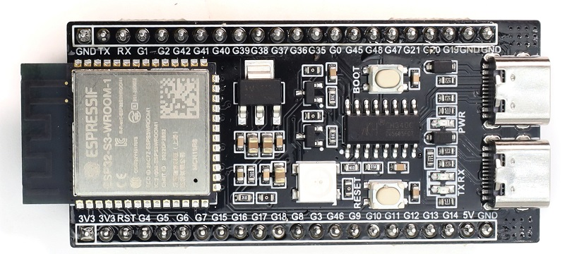
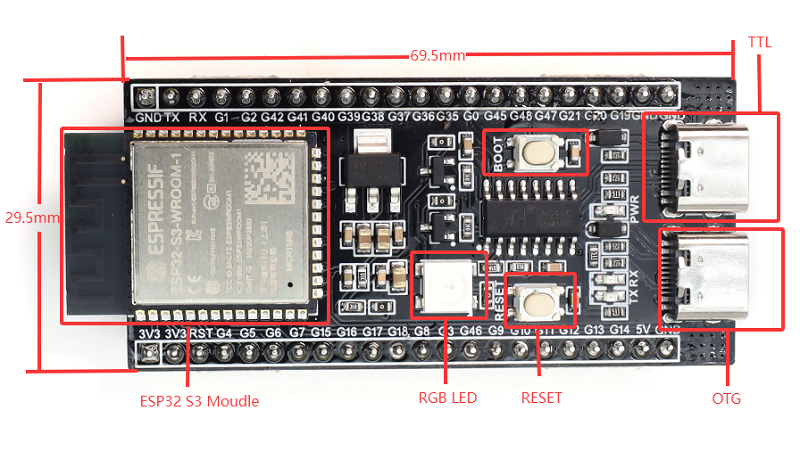
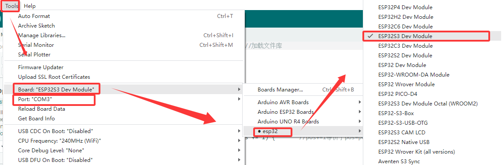
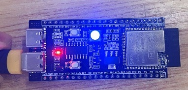

# MB0183 S3 mini



## 1. Introduction

The S3 mini development board is based on the Espressif ESP32 S3 WROOM-1-N16R8 module. It integrates a dual-core Xtensa LX7 MCU with a main frequency of up to 240MHz, storage(16MB FLASH and 8MB SRAM) and 2.4GHz Wi-Fi and BLE(Bluetooth® LE). As for its interfaces, it comes with Type-C to serial port, Type-C to OTG, RGB LED, and GPIO pin headers. These two rows of pins are with a spacing of 25.5mm, which is convenient to quickly develop and experiment. What’s more, it can be widely applied to smart home, industrial automation, healthcare, consumer electronics, smart farm, etc.

## 2. Parameters

- Operating voltage: DC3.3V
- Input voltage: DC3.3~DC5V 
- Operating current: 80mA(average)
- ESP32 module: ESP32-S3-WROOM-1
- FLASH: 16MB
- Clock frequency: 240MHZ
- USB-to-serial port: Type-C interface; CH340C USB-to-serial port chip (programs can be downloaded through this interface.)
- USB-to-OTG: Type-C interface; used for debugging or mounting external storage devices
- Product size: 69.5*29.5mm

## 3. Interface Description


For specific pin functions, please refer to the [User Manual](https://www.espressif.com.cn/sites/default/files/documentation/esp32-s3_datasheet_cn.pdf).

## 4. Arduino

For the installation of Arduino IDE, please refer to: [Arduino IDE](https://docs.keyestudio.com/projects/KT0303/en/latest/docs/Arduino_Tutorial.html#arduino-ide).

### Download

In the installation reference, there are instructions on how to install the ESP32 chip package (the version can be the latest), so there is no need to elaborate further here.

First, open the Arduino IDE software, click Tools -> Development Board -> esp32 -> ESP32S3 DEV Moudle; choose the new port after connecting to the development board via the USB cable (If there is no new serial port, please check whether [CH340 driver](https://docs.keyestudio.com/projects/KT0303/en/latest/docs/Arduino_Tutorial.html#arduino-ide) is installed or replace the USB cable).



Then copy the following program to burn it onto the development board.

```
void setup() {
  // No need to initialize the RGB LED
}

// the loop function runs over and over again forever
void loop() {
#ifdef RGB_BUILTIN
  digitalWrite(RGB_BUILTIN, HIGH);  // Turn the RGB LED white
  delay(1000);
  digitalWrite(RGB_BUILTIN, LOW);  // Turn the RGB LED off
  delay(1000);

  rgbLedWrite(RGB_BUILTIN, RGB_BRIGHTNESS, 0, 0);  // Red
  delay(1000);
  rgbLedWrite(RGB_BUILTIN, 0, RGB_BRIGHTNESS, 0);  // Green
  delay(1000);
  rgbLedWrite(RGB_BUILTIN, 0, 0, RGB_BRIGHTNESS);  // Blue
  delay(1000);
  rgbLedWrite(RGB_BUILTIN, 0, 0, 0);  // Off / black
  delay(1000);
#endif
}
```
After burning the code, the RGB on the development board will flash in the sequence of “white - red - green - blue - off”.



## 5. Precautions

1. Cannot burn the program to the development board?

	A: Please replace the data cable or reinstall the CH340 driver.

2. Please do not directly connect high-power motors through the IO port.


